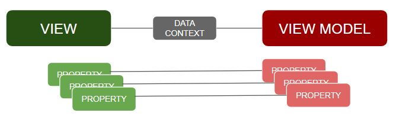

MVVM 2.
===
> Model - View - View Model

**MVVM을 설계하는 방법**
> 본 글은 WPF App 중심으로 기술되어 있으므로 착오 없으시길 바랍니다

View
---

VIEW 란, 전 글에도 명시해 놨듯, UI를 CONTROL 하는 영역으로 볼 수 있다.

이 VIEW는 **XAML** 이라는 Mark Up Language로 작성되며, 

디자이너가 직접 프로젝트 솔루션 내에서 UI작업을 진행 할 수 있도록 구성되어 있다.

> 즉 디자인 작업과 로직작업의 독립화를 꾀했다는 것이다.

기본적으로 visual Studio 상에서 편집과 표현이 가능하지만,

Micro Soft 에서 발표한, 디자이너를 위한 Blend for Visaul Studio 를 통해 편집하는 경우가 많다고 한다.
> 훨씬 어렵다고도 한다 ...

이는 해당 솔루션프로젝트의 부분으로 존재, 빌드시 XAML view 파일들도 동시에 함께 빌드된다.

만약 본인이 WPF App에서 새로운 XAML 파일을 생성하게 되면, CS라는 확장자가 붙은 코드 비하인드 파일이 따라오는데,
> 경험해 보지 못했다면, 먼저 경험을 하고 오는것을 추천한다.

이 CS 확장자를 가진 코드 비하인드 파일도 VIEW의 일부분으로 간주한다.

즉 이 코드 비하인드파일에 로직을 기술해선 안된다는 것이다.

XAML 은 HTML과 같이 xml을 기반으로 이루어져 있다.

xml형식의 태그를 통해 namespace mapping과 attribute를 사용하여 작성할 수 있다.
> Attribute와 실제 value의 연결의 편의를 위해 Data Trigger, Selecteor, Type Converter 들이 존재한다.

손쉽게 UI를 작성할 수 있게 해준다.. 라고 한다
> 개인적으로 그렇진 않은것 같다..

VIEW MODEL
---

VIEW MODEL은 WPF에서 특별히 제공하는 기능은 아니다..

그렇다고 BCL에 속해있는 클래스들도 아니라고 한다.

그냥 내가 VIEW MODEL로써 쓰임새를 갖춰 만들면 그것이 VIEW MODEL이 되는것이다.
> 무슨소리냐면 먼저 이렇게 써라! 하고 만들어 놓지는 않았다는 이야기이다.

웹 프로그래밍을 JSP 와 SERVLET으로 작성할 때, MVC MODEL2 를 이용하는데,

이때도 뭐 ECLIPSE나 JAVA에서 별도의 뭔가를 지원해 주지 않는 것처럼

패턴구현이 다 그런가 싶다.

> 개인적인 견해입니다. 아닐수도 있음

VIEW MODEL은 VIEW의 뇌이다! 정도로 표현할 수 있을 것 같다..

VIEW가 사람의 몸 그러니깐 그냥 외형이라면,

VIEW MODEL은 소화기능, 배설기능.. 등등의 기능을 담당한다고 볼 수 있을것 같다.

외형과 기능을 분리해낸 것이다.

> 디자이너와 로직개발자의 공간을 독립시키기 위함이다.

즉 VIEW MODEL은 VIEW가 가진 PROPERTY, BEHAVIOR, COMMAND 등을 별도로 묶어서 기술해놓은 **클래스**이다.

그렇기 때문에 모듈화가 가능해졌고, 어느 VIEW 던, 필요한 VIEW MODEL의 기능을 인스턴스화 하여 사용할 수 있게 되었다.
> 이것은 매우 중요한 요점이다. 객체 지향에서 모듈화는 매우 효율적이고 훌륭한 기능이며, 골머리를 덜 아프게 해주고 심지어 타자도 덜쳐도 된다!.
> 타자를 덜 친다는것은 즉 코드가 짧아진다는 것이며, 그것은 유지보수에 큰 도움이 된다. 
> 결론적으로 MVVM을 따르지 아니할 이유가 없다고 본다.

이 쯤 되면 MVC MODEL2를 아는 사람이라면

MVC의 CONTROLLER 가 MVVM의 VIEW MODEL과 동치인가? 라고 생각할 수 있겠다.

잠시 DATA CONTEXT에 대한 이야기를 하고 넘어가도록 하자.

### DATA CONTEXT ?

정보의 집합이다. 

문맥이라고 한국말로 번역이 되는데, 그닥 와닿는 의미는 아닌것같다..

자 아까 VIEW MODEL 에서 VIEW의 기능을 즉 LOGIC을 기술해 놓았다고 했는데,

그럼 VIEW MODEL과 VIEW의 연결 (이제 부터는 의존성이라고 표현하자)을 어떻게 해줄것인가?

바로 이 DATA CONTEXT를 사용하면 된다.

자 그럼 이게 어떻게 연결이 되는것이냐.. 할 수 있기 때문에 그림을 준비해 보았다.

