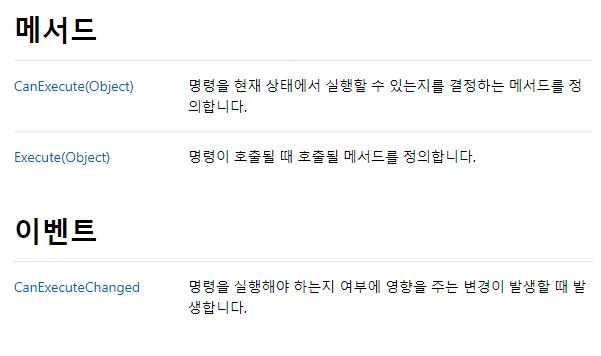

Command & Data Binding beetwenn View <-> View Model
===

1. Data Binding
---

긴 말 없이 바로 XAML 코드부터 보도록 하자.

**XAML**
~~~
<Window x:Class="TelerikWpfApp3.MainWindow"
                xmlns="http://schemas.microsoft.com/winfx/2006/xaml/presentation"
                xmlns:x="http://schemas.microsoft.com/winfx/2006/xaml"
                xmlns:telerik="http://schemas.telerik.com/2008/xaml/presentation"
                Title="MainWindow" Height="350" Width="525"
               xmlns:local="clr-namespace:TelerikWpfApp3">
    <Window.DataContext>
        <local:ViewModel></local:ViewModel>
    </Window.DataContext>
    <Grid>
        <Button Content="Server Run" Command="{Binding ServerRun}" Margin="10,36,279,242" ></Button>
        <TextBlock x:Name="ServerStatus" HorizontalAlignment="Left" Height="23" TextWrapping="Wrap" Text="{Binding serverStatus}" VerticalAlignment="Top" Width="228" Margin="10,8,0,0"/>        </Button>
    </Grid>
</Window>
~~~

Button에는 ServerRun이라는 Command가 Binding 되어있고, 

TextBlock 에는 ServerStatus 라는 무언가가 Binding이 되어있다.

~~~
  <Grid>
        <Button Content="Server Run" Command="{Binding ServerRun}" Margin="10,36,279,242" ></Button>
        <TextBlock x:Name="ServerStatus" HorizontalAlignment="Left" Height="23" TextWrapping="Wrap" Text="{Binding serverStatus}" VerticalAlignment="Top" Width="228" Margin="10,8,0,0"/>        </Button>
    </Grid>
~~~

> 어딘지 모르겠다면 이부분이다.

해당 View는 Socket Server를 동작시키고, TextBlock을 통해 현재 Server의 동작 상태를 알려주도록 설계 되어있다.

이제 이 XAML의 Control에 Binding 할 View Model을 작성해 보자.

**ViewModel.cs**
~~~
namespace TelerikWpfApp3
{
    public class ViewModel : INotifyPropertyChanged
    {
        MainSock mainSock = null;
        private string _serverStatus;
        public string serverStatus
        {
            get
            {
                return this._serverStatus;
            }
            set
            {
                this._serverStatus = value;
                OnPropertyChanged("serverStatus");
            }
        }
        public event PropertyChangedEventHandler PropertyChanged;
        protected void OnPropertyChanged(string name)
        {
            PropertyChanged?.Invoke(this, new PropertyChangedEventArgs(name));
        }

        private bool nowListen = false;
        public ICommand ServerRun { get; set; }
        public ViewModel()
        {
            ServerRun = new Command(ExecuteServerRun, CanExecuteMethod);
            serverStatus = "now Server is not Running";
        }

        private void ExecuteServerRun(object obj)
        {
            if (this.nowListen == true)
            {
                MessageBox.Show("Server is Already Run!!");
                return;
            }
            else
            {
                mainSock = new MainSock();
                mainSock.mSock=mainSock.makeSock();
                mainSock.bindSock(mainSock.mSock);
                mainSock.RunServer(mainSock.mSock);
                this.nowListen = true;
                serverStatus = "now Server is Running";
            }
        }
        private bool CanExecuteMethod(object arg)
        {
            return true;
        }
    }
}
~~~

코드가 조금 길 수 있으므로 분할하여 보도록 하자.

~~~
 public class ViewModel : INotifyPropertyChanged
    {
        MainSock mainSock = null;
        private string _serverStatus;
        public string serverStatus
        {
            get
            {
                return this._serverStatus;
            }
            set
            {
                this._serverStatus = value;
                OnPropertyChanged("serverStatus");
            }
        }
        public event PropertyChangedEventHandler PropertyChanged;
        protected void OnPropertyChanged(string name)
        {
            PropertyChanged?.Invoke(this, new PropertyChangedEventArgs(name));
        }

~~~

우선 클래스의 생성 부분이다.

ViewModel Class의 Member 변수들은 View의 Data를 Binding 하는데 이용되며,

서로 값을 변경 시킬 수 있는 Binding Mode인 Two Way를 사용해야 하므로,

Custom Property인 serverStatus를 Dependency Property로 만들어 줘야 한다.

그래야 Logic 내의 변경된 값을 View에 온전히 전달할 수 있다.

> 혹여나 그렇지 않겠지만, Dependency Property를 선언할 수 없다면 또 익숙하지 않다면 이 글은 무의미하다.  
> 돌아가서 기초부터 쌓고 오길 바란다.

자 그러면 이제 해당 ViewModel 내에서 serverStatus는 언제 변경되던지 간에,

Binding으로 묶여있으므로, View에 변화를 만들어 낼 수 있게 되었다.

~~~
  private bool nowListen = false;
        public ICommand ServerRun { get; set; }
        public ViewModel()
        {
            ServerRun = new Command(ExecuteServerRun, CanExecuteMethod);
            serverStatus = "now Server is not Running";
        }

        private void ExecuteServerRun(object obj)
        {
            if (this.nowListen == true)
            {
                MessageBox.Show("Server is Already Run!!");
                return;
            }
            else
            {
                mainSock = new MainSock();
                mainSock.mSock=mainSock.makeSock();
                mainSock.bindSock(mainSock.mSock);
                mainSock.RunServer(mainSock.mSock);
                this.nowListen = true;
                serverStatus = "now Server is Running";
            }
        }
        private bool CanExecuteMethod(object arg)
        {
            return true;
        }
    }
}
~~~

그다음 Command에 관련한 부분이다.

우리가 아까 XAML에서 Button에 Binding 한 Command는  

~~~
  <Grid>
        <Button Content="Server Run" Command="{Binding ServerRun}" Margin="10,36,279,242" ></Button>
        <TextBlock x:Name="ServerStatus" HorizontalAlignment="Left" Height="23" TextWrapping="Wrap" Text="{Binding serverStatus}" VerticalAlignment="Top" Width="228" Margin="10,8,0,0"/>        </Button>
    </Grid>
~~~

**ServerRun** 이라는 무언가에 했었다..

~~~
public ICommand ServerRun { get; set; }
        public ViewModel()
        {
            ServerRun = new Command(ExecuteServerRun, CanExecuteMethod);
            serverStatus = "now Server is not Running";
        }
~~~

고로 당연히 ServerRun은 존재해야 한다.

하지만 이 ServerRun은 Method의 이름이 아닌,

ICommand라는 InterFace의 Instance 처럼 보인다.

그리고,

~~~
 ServerRun = new Command(ExecuteServerRun, CanExecuteMethod);
~~~

현재 ViewModel의 생성자에서,

ServerRun이라는 InterFace Instance를 Command라는 클래스로 Instance화 하였다.

어디서 많이 들어본 내용이여야 하고,

분명히 이해가 가는 내용이어야 한다.

왜? Interface는 객체지향에서 자기 자신으로 Instance화 될 수 없으며,

굳이 하기 위해선 파생 클래스를 통하여 Instance화 해야 한다는것을 알고 있을것이다.

> 이것도 잘 모른다면 돌아가길 바란다.

즉 Command라는 Class를 통해 ServerRun은 Instance가 되었고,

Command는 Interface일리도 없고, 그렇다고 Abstract Class일리도 없으니, 분명 Class일 것이다.

그리고 반드시 ICommand를 상속받았을 것이다.

자 그럼 이 Command는 무엇을 using 해야 쓸 수 있냐? 빨간줄 뜨는데? 

정답은 **직접 제작해야 한다** 이다.

잠시 Command Class에 대해 알아보도록 하자.

~~~
namespace TelerikWpfApp3
{
    public class Command : ICommand
    {
        Action<object> _executeMethod;
        Action<object, object> _executeMethod2;
        Func<object, bool> _canexecuteMethod;

        public Command(Action<object> executeMethod, Func<object,bool> canexecuteMethod)
        {
            this._executeMethod = executeMethod;
            this._canexecuteMethod = canexecuteMethod;
        }
        public event EventHandler CanExecuteChanged;

        public bool CanExecute(object parameter)
        {
           return true;
        }

        public void Execute(object parameter)
        {
            _executeMethod(parameter);
        }
    }
}
~~~

이것이 Custom Class인 Command Class이다.

Action과 Func 내장 Delegate 변수를 활용하여 설계되었다.

우선 ICommand라는 InterFace를 상속받았으니,

ICommand의 기능을 모두 구현해 주어야 한다.

MSDN에 따르면 ICommand Interface는 다음과 같은 Member와 Method를 갖는데,

~~~
        public event EventHandler CanExecuteChanged;

        public bool CanExecute(object parameter)
        {
           return true;
        }

        public void Execute(object parameter)
        {
            _executeMethod(parameter);
        }
~~~
그래서 이렇게 구현해주어야 한다.

위에 보이는 method들의 쓰임새에 대하여 설명해 보자면..

**CanExecute**는 현재 이 method가 실행가능한지 아닌지를 판별하는 기능을 가지고 있다.

> 지금 현재는 실습이 목적이므로 전부 True를 Return 해주도록 하겠다.

**Execute**는 말 그대로 parameter로 전달받은 무언가를 매개변수로 하여 무언가를 하는것 처럼 보인다.

더 자세히 보자.

~~~
   public void Execute(object parameter)
        {
            _executeMethod(parameter);
        }
~~~

_executeMethod는 분명 Action delegate였다.

~~~
        Action<object> _executeMethod;

~~~

그러므로 우리가 알 수있는것은,

아 이 _executeMethod를 통해서, parameter로 담아온 method를 실행시키겠구나,

그리고 그것은 반환형이 없어야 겠구나! 이다.

> 왜 return type이 없냐고?, Action은 return Type이 없는 method를 대리할 수 있는 delegate 이기 때문이다.

자 그럼 이 ICommand Interface에 대해선 거진 이해가 되었을텐데,

아니 그럼 도대체 뭘실행하고 어떻게 흘러가는 것인가??... 할 수 있다.

그래서 보다 이해하기 편하게 누구도 안했던 이미지를 준비해 보았다.

다음과 같은 Flow로 흘러가는 것이다.

일단 오늘은 여기까지.

