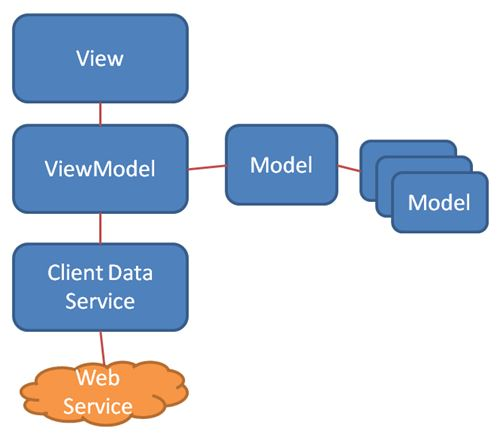
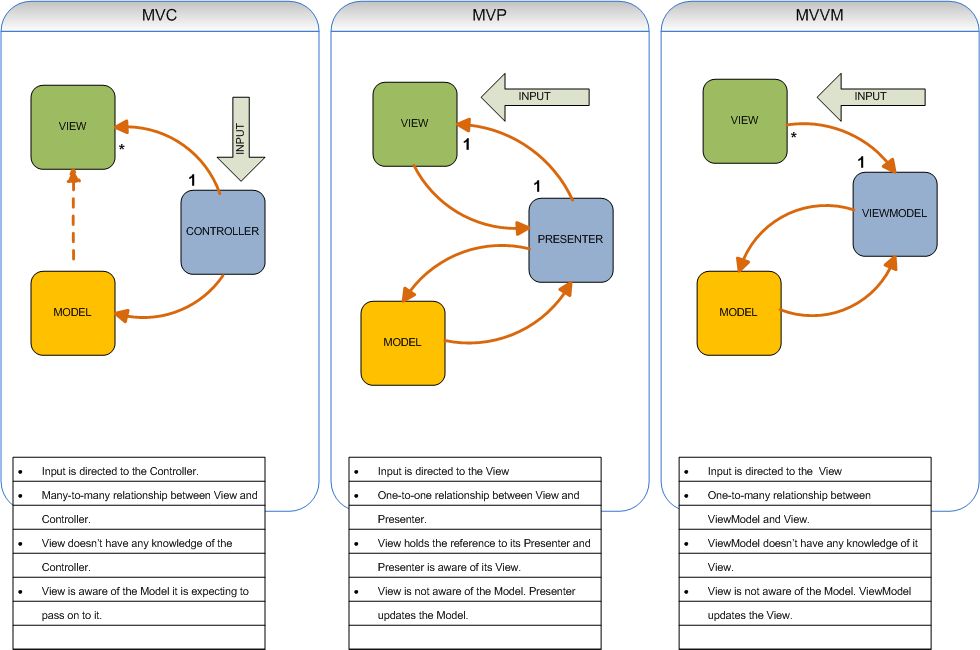
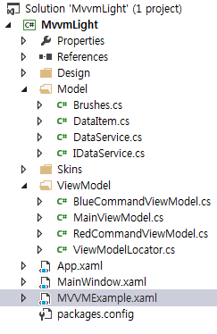

MVVM PATTERN
==
> 오늘은 WPF가 지향하는 패턴 모델인 MVVM에 대하여 알아보도록 하겠습니다.

MVVM이란?
--
>위 그림처럼 Model - View - ViewModel로 이루어진 패턴,

MVC가 Model - View - Controller 로 이루어져 있다면,

MVVM은 Model - View - ViewModel로 이루어진 패턴을 의미한다.

MVVM도 MVC의 변종이라고 볼 수 있다.
 
 

Model, View, ViewModel이란 ?
--

> mvc, mvvm, mvp 모델간의 차이점을 통해 분석하도록 하자.

- Model : 일종의 데이터, 및 조작하는 간단한 로직 (Class파일 등)

- View : Display 사용자에게 제공되어지는 UI Layer를 뜻함 wpf에서는 XAML로 분류된다.

- ViewModel : View를 나타내주기 위한 Model이다. View보다는 Model과 유사하게 디자인되며, View의 데이터를 바인딩 할 수 있는 기능을 내포한다.

MVVM 패턴의 가장 큰 장점은 Data Binding이다. 

MVP패턴과는 달리! View와의 Dependency를 완벽히 분리한다.
> View <-X-> View Model 이므로 분리된다고 말하는 것이다.

또한 Command를 이용, Behavior를 View의 특정 Event와 연결가능하며 
> 게임 개발시 상당히 유용하다.

ViewModel의 속성과 특정 View의 속성을 Binding 시켜줌으로써, ViewModel이 변경됨에 따라 View도 변경 시킬 수 있다.

 
 

Visual Studio와 코드를 통해 더 깊이 이해하도록 하자.
---

 - Model : class
 - ViewModel : cs
 - View : XAML
로 구성된것을 쉽게 확인 할 수 있다.

