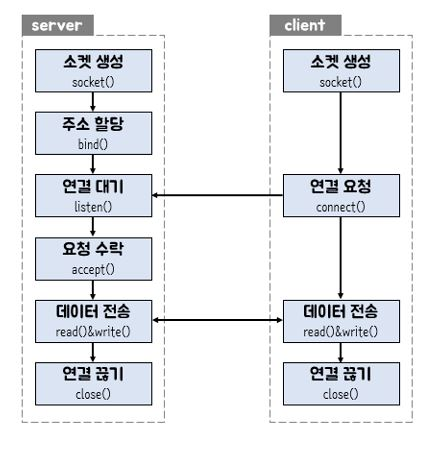
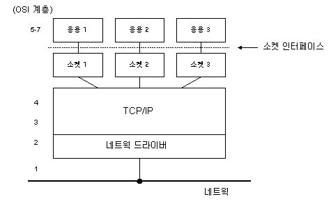
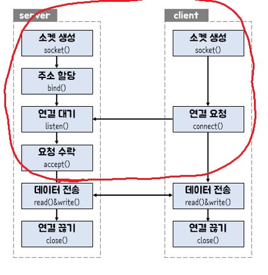
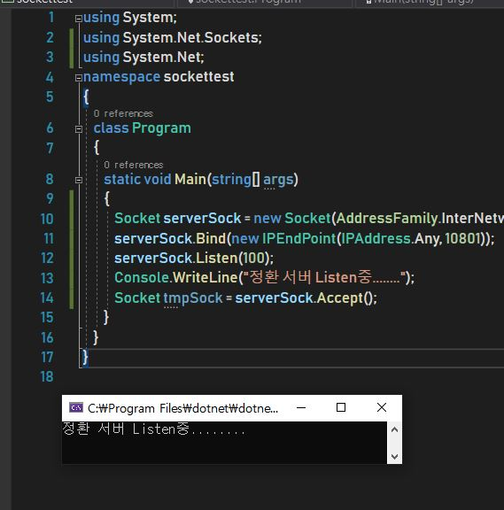
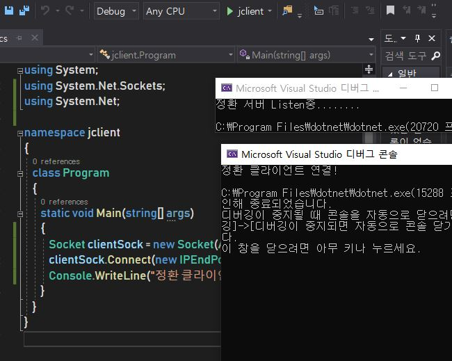

Socket 이란?
===

Socket은 TCP/IP로 통신하는 네트워크 내에서 일어나는 통신 방법이다.

IP주소와 PORT번호로 생성되는 네트워크 주소를 통해, 클라이언트와 서버가 통신되도록 하는 것

이렇게 두 프로그램 또는 두 클라이언트가 네트워크를 통하여 서로 통신을 수행할 수 있도록 

**양쪽**에 생성되는 링크의 단자이다.

두 소켓이 연결되면 서로 다른 프로세스끼리 데이터를 송/수신 할수있따.

자 위 그림에서 보면, SERVER와 CLIENT로 입장이 나뉘어 있는데

무슨 차이가 있느냐면,

 - 서버 : 연결을 수동적으로 기다린다.....
 
 - 클라이언트 : 능동적으로 연결한다!!
 
 요 정도 차이가 있다고 보면 되겠다.
 
 
 
 결론적으로
 ---
 
 소켓은 TCP/IP와 APPLICATION 사이의 창구 역할을 한다고 보면 되겠다!
 
 소켓을 이용하면, 인터넷의 복잡한 하부구조에 대한 세부적인 지식이 없어도 손쉽게 네트워크를 이용한 프로그램을 개발 할 수 있다.
 
 TCP/IP 4계층 응용계층 바로 아래에 소켓을 제작하여, 응용계층만 신경쓰고 네트워크를 개발 할 수 있다.
 
 호오오오
 
 자 그럼 소켓을 어떻게 C#에서 사용하느냐 ??
 ---
 
 사실 대부분의 언어에서 소켓은 비슷한 원리로 동작한다.
 
 마치 DATA BASE를 쓰는것처럼 ..
 
 .NET 에서는 이 SOCKET을 이미 클래스로 만들어 놓았다 !!
 
 ~~~
 using System.Net.Sockets;
 
 Socket userSocket = new Socket(,,,);
 ~~~
 
 이러면 소켓 객체가 생성되었다 .. !
 
 wow
 
 사실 실제로 사용하려면 매개변수를 넣어야 하지만 일단 지금은 이렇게 넘어가도록 하자..
 
 
 서로 다른 두 소켓의 연결!
 ---
 
 통신이라는 것은 불특정 대상과 무언가를 하는 것이므로,
 
 혼자하는 것은 통신이라고 할 수 없다.
 
 소켓도 동일하게 client와 server로 분리 해 볼수 있는데,
 
 아까 위에 올렸던 그림을 다시 불러와 보자.
 
 

기본적으로 두개의 소켓을 연결 할 때 이러한 과정을 따른다.

server와 client는 각각 하는 일이 다르기 때문

SERVER
---

이놈은 대기를 하는 소켓이다. 

계속 listen 상태에 있으면서 requset에 response를 해준다.

> 계속 listen 상태이다 .. ? TCP ! 3-way HandShaking의 느낌이 올라오지 않는가 ??

누가 Requset를 보낼지는 모르지만, 그냥 계쏙 대기해 본다...

아무튼 누가 Request를 보내면 이때다 싶어서 Response를 보내준다.

제작 순서!

1. **Bind()** 메소드를 통해 소켓에 IP주소와 프로토콜 등을 할당한다. 
> 사실상 이때부터 진정한 소켓이 된다고 볼 수 있다.

2. **Listen()** 메소드를 통해 계속하여 대기하도록 한다.

3. 외부의 접근이 발생하면 **accept()** 메소드를 호출하고 연결한다.

4. 통신한다 **Read() & Write()** 
> 실제로 데이터를 공유하는 부분이다.

Client Socekt
--

client는 서버에 요청을하는 역할을 한다.

능동적으로 언제든 요청을 할 수 있으며, Bind작업을 필요로하지 않는다.

**Connect()** 메소드를 통해 **Listen()**중인 Server의 소켓에 접근, 

**Accept()**를 서버로 하여금 이끌어 낸다.

Server에 비해 매우 간단하다.

드디어!! 통신 동작 원리
---

- 1. Server Socekt이 Bind()를 하고 Listen()상태로 대기
- 2. Client Socket은 Connect()로 Server Socket에 접근
- 3. Server Socket은 Accept()를 통해 Client()와 Server()사이의 Connection을 설정함
- 4. 원하는 통신을 한다.
- 5. 통신 Close

하지만 여기서 중요한 점

사실은 Listen 상태인 Server 소켓에 Connect를 보내고, 그것을 Accept하면서 이 둘사이에만 연결이 이루어지지는 않는다.

뭔소리냐 ??

Server의 본진은 Listen을 하다가, Client의 Connect()요청을 받으면,

**새로운 소켓을 하나 더 만든다** 

그리고 이녀석으로 통신을 한다.

기존의 소켓은 **꼐속 Listen()상태에 머물러, 다른 소켓과의 통신을 대비한다.**

구현 with C#
---

> 요 빨강색 부분 부터 해보도록 할게여!  
> 참고로 펜으로 칠해서 잘 칠해지진 않았습니다 .. ㅎㅎ

## server : bind(), Listen()

서버부터 시작하도록 하죠!

동작은 다음과 같이 해야 합니다.

- 1. server socekt을 bind 한다.
- 1. server socket이 listen한다.
- 2. clinet socket이 server에 connetc 한다.
- 3. server socket이 client를 accept한다. 이 때 server는 자신의 분신을 만들어 accept한다!! (본진은 계속 listen)

**[ 코드가 없으면 섭섭하겠지? ]**
~~~
using System;
using System.Net.Sockets;
using System.Net;
namespace sockettest
{
    class Program
    {
        static void Main(string[] args)
        {
            Socket serverSock = new Socket(AddressFamily.InterNetwork, SocketType.Stream, ProtocolType.IP);
            serverSock.Bind(new IPEndPoint(IPAddress.Any, 10801));
            serverSock.Listen(100);
            Console.WriteLine("정환 서버 Listen중........");
        }
    }
}
~~~

자자자 설명 들어가겠습니당

### 소켓 만들기!!!
~~~
Socket serverSock = new Socket(AddressFamily.InterNetwork, SocketType.Stream, ProtocolType.IP);
~~~

1. 새로운 Socket 객체를 하나 생성했습니다!

2. 파라미터는 3개가 필요한데요, 파라미터들에 대한 설명을 하고 넘어가도록 할게요

#### 파라미터

##### AddressFamily.InterNetwork는 사용할 주소체계를 나타냅니다.

 - 자 여기서, Adress Family는 주소를 어떻게 지정할 것인지에 대한 '주소지정스키마' 입니다.

 - interNetwork는 기존의 IP주소 체계인 IPv4의 주소 체계입니다. v6를 사용한다면 다른 프로퍼티를 사용해야 하겠죠..?

##### SocketType.Stream 은 데이터의 전송 방식입니다..

 - SocketType은 말 그대로 소켓의 타입이에요, 무슨 데이터형을 담을 소켓이냐..? 대략 이런 의미인거 같은데 
    > 솔직히 아닐수도 있씁니다..

 - Stream이란 데이터 중복이나 경계 유지없이 신뢰성있는 양방향 연결 기반의 byte stream을 지원해줍니다.

#####  ProtocolType.IP

 - Protocol Type은 말그대로 통신규약을 뭐쓸거니?? 라고물어보는거네요, IP를 써주도록 하겠씁니다.

자 이렇게 소켓 객체를 간단히 생성해 보았습니다 아주 쉽죠!?

### 소켓 바인딩하기!!!
~~~
serverSock.Bind(new IPEndPoint(IPAddress.Any, 10801));
~~~

소켓을 만들었으면 해당 소켓이 어떤 client의 요청을 받아 들일 것이지, 또 어떤 포트를 사용할건지에 대해 설정해줘야 합니다.

이것은 IPEndPoint 객체를 이용해서 작업을 수행 할 수 있는데요,

IPEndPoint란 IP의 끝점이에요 종단점이라는 뜻이죠,

우리의 소켓은 뭐죠?? 통신의 극점(EndPoint)에요, 자 한마디로 통신의 극점에 바인드 하겠다!! 라는겁니다.

그럼 어디에 바인드 할지도 알아야 겠죠?? 파라미터를 통해 적용시켜 봅시다.

우선 IPAddress.Any는 모든 클라이언트에서 오는 요청을 받겠다는 거에요 아무나 다 드루와!! 같은 겁니다.

뒤에 나오는 10801은 포트번호입니다. 

한마디로 10801번 포트로 오는 모든 client의 requset는 다드루와 에요 그리고 그곳은 통신의 극점인 소켓 이라는 거죠!

**포트번호는 임의로 사용한 것이니 반드시 따라할 필요는 없어요**

### 서버 Listen 시키기!!!

~~~
serverSock.Listen(100);
~~~

Listen()입니다. 

소켓이 되어버린 serverSock객체는 이제 Listen() 상태로 빠집니다

파라미터로 integer하나가 필요한데 

이것은 해당 서버소켓이 연결을 대기하게 할 수 있는 최대 대기자 목록입니다.

100개의 소켓이 대기할 수 있다는거에요 

자 이렇게 server측 소켓 작업은 마무리 되었습니다. 

우선 client가 제가 만든 이 server 소켓에 connect() 하도록 만들어 볼게요

## Client : Connect()

이미 server 소켓은 listen() 하고 있어요,

이제 우리는 Connect()만 보내주면 됩니다! 

당연히 프로젝트는 두개로 진행해야 겠죠 ??

**[예제 투척]**
~~~
using System;
using System.Net.Sockets;
using System.Net;

namespace jclient
{
    class Program
    {
        static void Main(string[] args)
        {
            Socket clientSock = new Socket(AddressFamily.InterNetwork, SocketType.Stream, ProtocolType.IP);
            clientSock.Connect(new IPEndPoint(IPAddress.Loopback, 10801));
            Console.WriteLine("정환 클라이언트 연결!");
        }
    }
}
~~~

자이렇게 아까와 같은 방식으로 연결을 시도해줍니다.

바뀐건 하나밖에 없어요!!

뭐냐면

#### Client: Connect()

이미 server는 listen 중이므로 우리는 connect 요청만 보내주면 됩니다.

~~~
clientSock.Connect(new IPEndPoint(IPAddress.Loopback, 10801));
~~~

Listen() 중인 server에 client는 Connect 요청을 보냈습니다.

IPEndPoint 객체는 왜 사용 했을 까요 ??

당연히 어느 소켓에 연결해야 되는지 알아야 하잖아요 ..

저는 제 컴퓨터의 서버에 제컴퓨터의 클라이언트가 연결되므로 ip는 Loop Back을 사용했어용

만약 다른 컴퓨터의 클라이언트라면... 서버의 ip address를 지정해줘야 겠쬬??

자 이제 clinet에서 Connect를 했으니 Server에서 Accept를 해봅시다!!

## Server : Accept()

~~~
Socket tmpSock = serverSock.Accept();
~~~

별 다를게 없습니다.. 

아까 말씀드렸죠 ?? 본진은 대기하고 분신을 만든다!!

분신인 tmpSock을 만들어서 serverSock에 Connect된 client socket을 Accept 해줍니다!

자 이러면 Clinet와 Server의 소켓연결은 끝났습니다.

# 난 안되는데 ? 하시는 분들을 위해

**[서버 소켓 bind -> listen]** 

 
**[클라이언트 소켓 Connect -> 서버 소켓 Accept]**

저는 됩니당 
