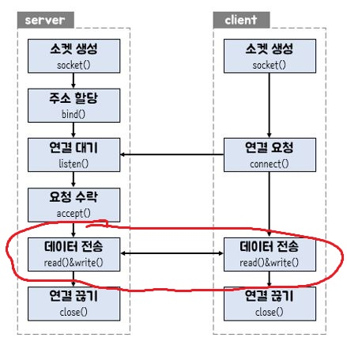

# Socket with C#

오늘은 요 빨간색 부분 할겁니다.

군말없이 바로 가도록 하죠

저번에 소켓을 연결하는데 까지만 하고 뭔가 전송은 안해봤습니다 

이제는 실제로 뭔가를 주고 받아 보도록 하겠습니다

우리의 목표는 메신저이므로 **문자열** 을 목표로 해보도록 하겠습니다.

## Server : Send Message

자. 이제 저번에 만들었던 tmpSock 이라는 client와 연결된 Socket 객체를 통해 메세지를 보내 볼게요

~~~
using System;
using System.Net.Sockets;
using System.Net;
using System.Text;

namespace sockettest
{
    class Program
    {
        static void sendStr(IAsyncResult a)
        {
            Socket tmpSock = (Socket)a.AsyncState;
            int strlen = tmpSock.EndSend(a);
        }
        static void Main(string[] args)
        {
            Socket serverSock = new Socket(AddressFamily.InterNetwork, SocketType.Stream, ProtocolType.IP);
            serverSock.Bind(new IPEndPoint(IPAddress.Any, 10801));
            serverSock.Listen(100);
            Console.WriteLine("정환 서버 Listen중........");
            Socket tmpSock = serverSock.Accept();
            byte[] msg = Encoding.Default.GetBytes("aaaaaaaaaaa");
            tmpSock.BeginSend(msg, 0, 11, SocketFlags.None, new AsyncCallback(sendStr), tmpSock);
        }
    }
}
~~~

이번엔 뭐가 좀 많습니다...

차근차근 하나씩 뜯어 보도록 할게요

### 보낼 텍스트 정하기
~~~
byte[] msg = Encoding.Default.GetBytes("aaaaaaaaaaa");
~~~

msg 라는 byte형 객체에 "aaaaaaaaaaa" 을 담습니다.

byte 형식으로 보내게 되있으므로 인코딩 과정을 거쳤습니다.

> **using System.Text;** 을 using 해주셔야 Encoding 을 이용하실 수 있어용

### Server : 메세지 보내기

~~~
tmpSock.BeginSend(msg, 0, 11, SocketFlags.None, new AsyncCallback(sendStr), tmpSock);
~~~

우선 **BeginSend()** 메서드는 데이터를 전송해줍니다.

파라미터로는 여러개가 필요한데요 이것도 하나하나 뜯어 봅시다...

#### 1. msg

그냥 byte형 메세지 입니다. 

#### 2~3. 0,11

그냥 0부터 11글자 라는겁니다.

aaaaaaaaaaa 가 11글자입니다..

#### 4. SocketFlags.None

SocketFlags 는 전송 옵션입니다.

사실 고급 옵션입니다. 우리는 그냥 None을 쓰도록 합시다 ..

사실 저도 잘 몰라유 ㅠ..

#### 5. new AsyncCallback(sendStr)

자 보시면 매개변수로 AsyncCallback이라는 메서드가 sendStr이라는 메서드를 받는걸 보실 수 있는뎅

제가 이게 뭐라그랬죠?

맞아요! 이게바로 그 유명한 **Call Back Method**입니다!!

분명 Delegate 설명하면서 했을 거에요

자 뭐하는 거냐? 전송과정이 다 끝난 뒤에 sendStr을 호출하라는 겁니다.

해당되는 비동기 작업을 완료할 때 호출되는 메소드를 지정해주는 친구입니다.

가장 중요한 점 기억하셔야 될건 전송이 끝나면 sendStr을 호출한다는 점이에요

#### 5-1. sendStr

이것도 메서드이므로 구현 해주어야 합니다.

자 그럼 얘가 뭐길래 전송이 끝나면 호출이 되는 거시냐 ?!

~~~
 static void sendStr(IAsyncResult a)
        {
            Socket tmpSock = (Socket)a.AsyncState;
            int strlen = tmpSock.EndSend(a);
        }
~~~

**[1]**
~~~
Socket tmpSock = (Socket)a.AsyncState;
~~~
보시면, tmpSock 이라는 소켓 객체가 (Socket) 으로 명시적으로 캐스팅 된 IAsyncResult 형의 a의 비동기 state를 받아옵니다.
> IAsyncResult 는 비동기 작업의 상태를 나타내 주는 객체입니다.

전송 소켓 객체의 상태를 가져온다는 것이죠..

전송이 끝났는데 왜가져 왔냐구요 ??

**[2]**
~~~
int strlen = tmpSock.EndSend(a);
~~~

전송이 끝나면 전송을 끝내줘야 하겠죠 ??

그래서 전송 소켓 객체를 가져온겁니다.

EndSend 메서드는 전송을 끝내버리는 기능이 있습니다.. 

반환값으로는 전송한 데이터의 크기를 되돌려줍니다. 그래서 int형으로 받은거에요

자 이렇게 데이터 전송 -> 전송 종료 는 모두 마쳤습니다.

이제 client측의 수신을 살펴볼게요

#### Client : 메세지 받기!

수신 과정은 송신 과정과 비슷해요

~~~
using System;
using System.Net.Sockets;
using System.Net;
using System.Text;

namespace jclient
{
    class Program
    {
        static byte[] getBytes = new byte[11];

        static void getStr(IAsyncResult a)
        {
            Socket clientSock = (Socket)a.AsyncState;
            int strLength = clientSock.EndReceive(a);
            Console.WriteLine(Encoding.Default.GetString(getBytes));
        }

        static void Main(string[] args)
        {
            Socket clientSock = new Socket(AddressFamily.InterNetwork, SocketType.Stream, ProtocolType.IP);
            clientSock.Connect(new IPEndPoint(IPAddress.Loopback, 10801));
            Console.WriteLine("정환 클라이언트 연결!");
            clientSock.BeginReceive(getBytes, 0, 11, SocketFlags.None, new AsyncCallback(getStr), clientSock);
        }
    }
}
~~~

자 뭔가가 많이 추가되었죠??

11byte를 BeginReceive()로 수신하여, receiveBytes에 대입하고 있네요, 

여기서 또 call back method가 등장합니다. 

이 call back method를 왜 사용하는가에 대하여 한번 얘기를 했었던것 같은데 이따가 다시 얘기 하도록 하겠습니다.

수신이 끝나면 실행 될 getStr 메소드가 받아온 byte (getBytes에 저장되어 있겠지요 ?)를 

String으로 Encoding하여 출력합니다.

자 이렇게 socket을 이용하여 server에서 client로 문자열을 전송해 보았는데요,

정리 한번 하고 마치도록 하겠습니다.

정리
===

1. Call Back Method는 왜 사용했는가 ?
---

자 여기서 주목해야될 점은 우리가 메세지를 보내고 수신할 때 어떤 메소드를 사용했느냐? 인데요

우리는 **BeginSend()** 메소드를 통하여 메세지를 송신하고,  **BeginRecive()**  메소드를 이용하여 수신하였습니다.

물론 .NET에는 메세지를 보내는 **Send()**  와 수신하는 **Reveive** 메소드도 존재합니다만

무슨차이가 있느냐 ?!

바로 **동기/비동기** 의 차이입니다.

메소드 앞에 **Begin** 이라는 문자가 붙으면 그것은 **비동기** 식 송/수신을 의미하고,

메소드 앞에 아무것도 붙지 않다면 그것은 **동기** 식 송/수신을 의미합니다.

우리는 여기서 **비동기 방식**을 사용하였습니다.

왜그랬을까요 ?

만약 우리가 **동기 방식** 을 사용했다면,

11byte가 모두 전송된 뒤에서야 다른 작업을 수행 할 수 있습니다.

11byte는 뭐 몇개 안되니깐 동기방식으로 써도 문제가 크게 없겠죠,

하지만 우리가 천만 byte를 전송한다면 어떨까요 ??

천만 byte의 전송이 종료되기 전까지 아무런 작업도 수행 할 수 없겠죠,

그래서 **비동기 방식**의 메소드인 **BeginSend/Receive()** 를 사용한 것입니다.

프로그램이 멈추거나 정지하는 일은 없을 것이고,

만약 전송이 완료되었다면 완료된 후의 작업은 Call Back Method를 이용하여 수행하도록 하면 됩니다.

음식점을 예로 들어보죠

주방장이 주방보조에게 이렇게 말하는 겁니다.

**나는 이제 국을 끓일건데, 너는 양파 다썰었으면 당근까지 썰고 퇴근해!**

자 이러면 여러가지 작업을 동시에 수행할 수 있게 되겠죠?

프로그램이 중간에 멈추는일을 방지하기 위하여 저는 **비동기 방식** 을 채택하였습니다.

질문있으시면 언제든지 메일 환영합니다.
