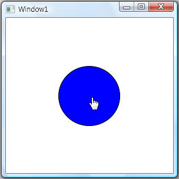
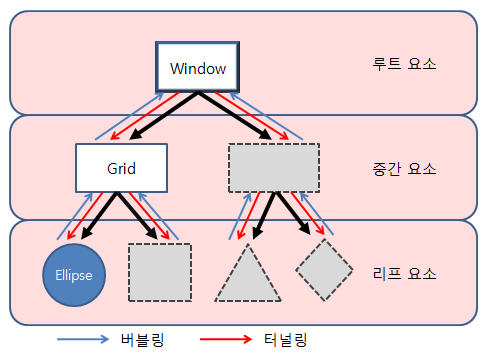

# WPF WITH .NET 

출처 : https://dotnetmvp.tistory.com/32?category=125280

## 1. Routed Event & Bubbling

.NET은 이벤트 관리 매커니즘을 정의 하거나 명시적으로 이벤트를 정의해주지 않아도 효율적으로 이벤트를 관리하도록 돕는다.

요 그림처럼 window 내에서는 자식요소로는 보이지 않지만,

Grid -> Ellipse 가 존재하는 예제이다.

  

다음 그림처럼 window 는 최상단 루트에 있고,

그 아래 grid 등등의 중간요소가 있으며

말단 요소로써는 윗 그림에서 표시된 동그라미가 있을 것이다.

만약 동그라미에서 이벤트가 발생한다!!

시나리오 : 파란색 화살표를 따라서 window 까지 올라간다.

원래 기존의 .NET은 이 동그라미의 이벤트 하나를 처리해주기 위해서 동그라미의 진 조상 집합 모두에게

이벤트 핸들러를 요구하였었으나, Routed Event를 이용하여 단순히 부모의 이벤트 핸들러를 호출하는것이 아니라,

자신의 상위요소를 거슬러 올라가 라우트된 이벤트가 등록된 모든 노드의 핸들러를 알아서 호출하게 되는 것이라고 한다.

이 동작은 라우팅된 이벤트에 정의된 기능이며 WPF 이벤트 처리의 핵심 메커니즘이다.

